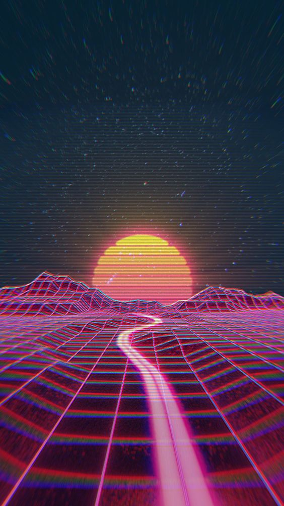
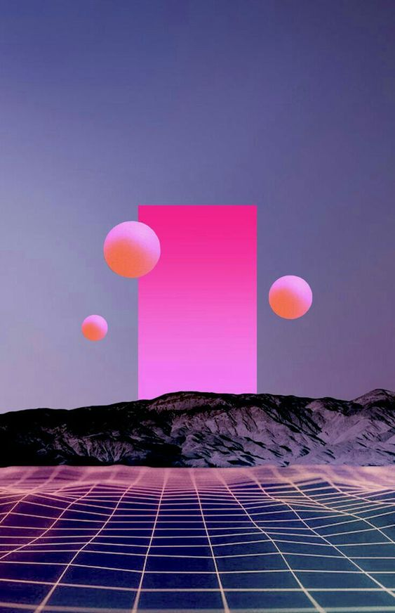
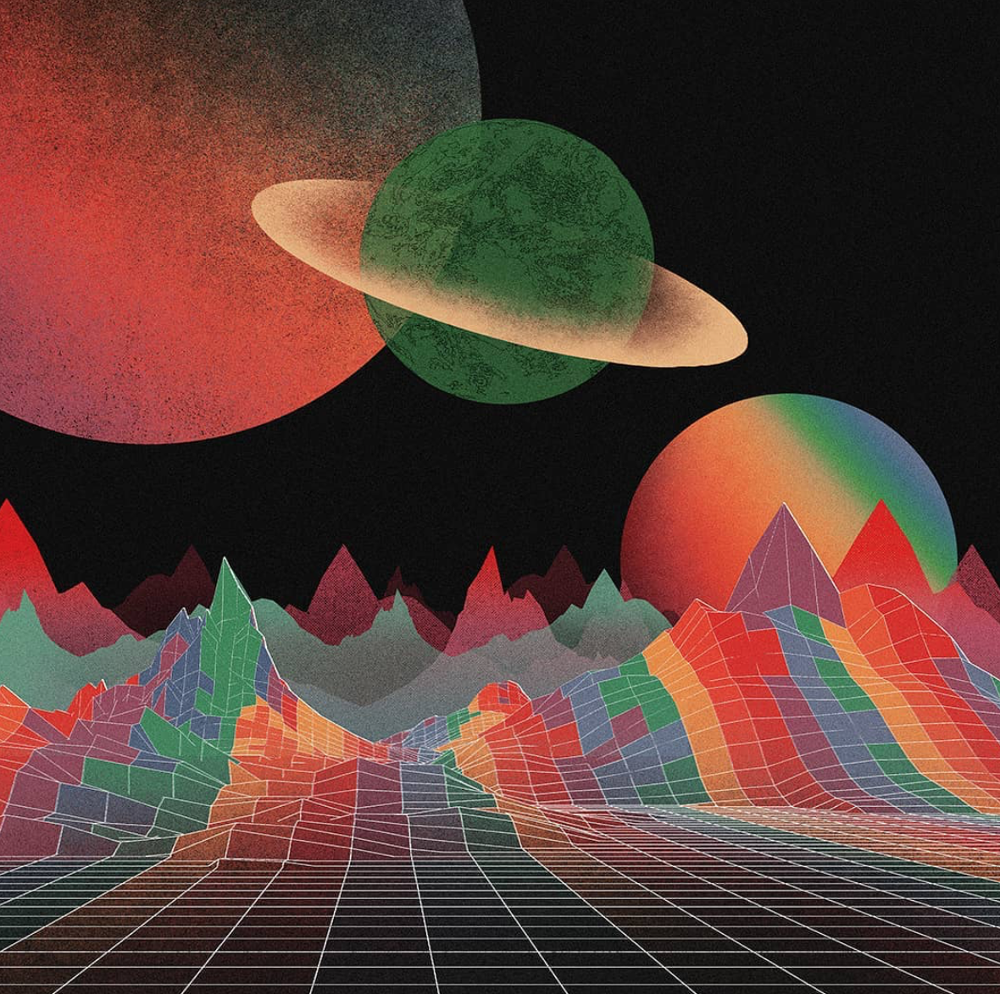
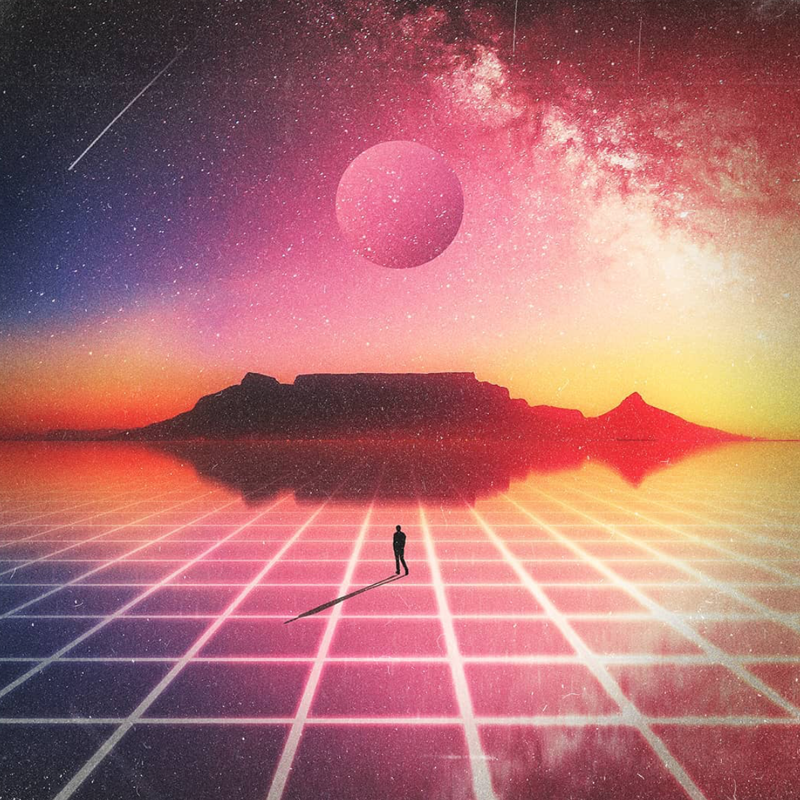

# A audiovisual virtual Road Trip

## Abstract

The project should serve to go through a complete workflow of a project in openframeworks and thus learn more about the framework and C++. For this I focused on the topics meshes and shaders on the one hand and sound on the other hand. The goal of the project was to create an interactive audiovisual graphic, which should remind of the atmosphere of a road trip. 

### Inspiration 

s